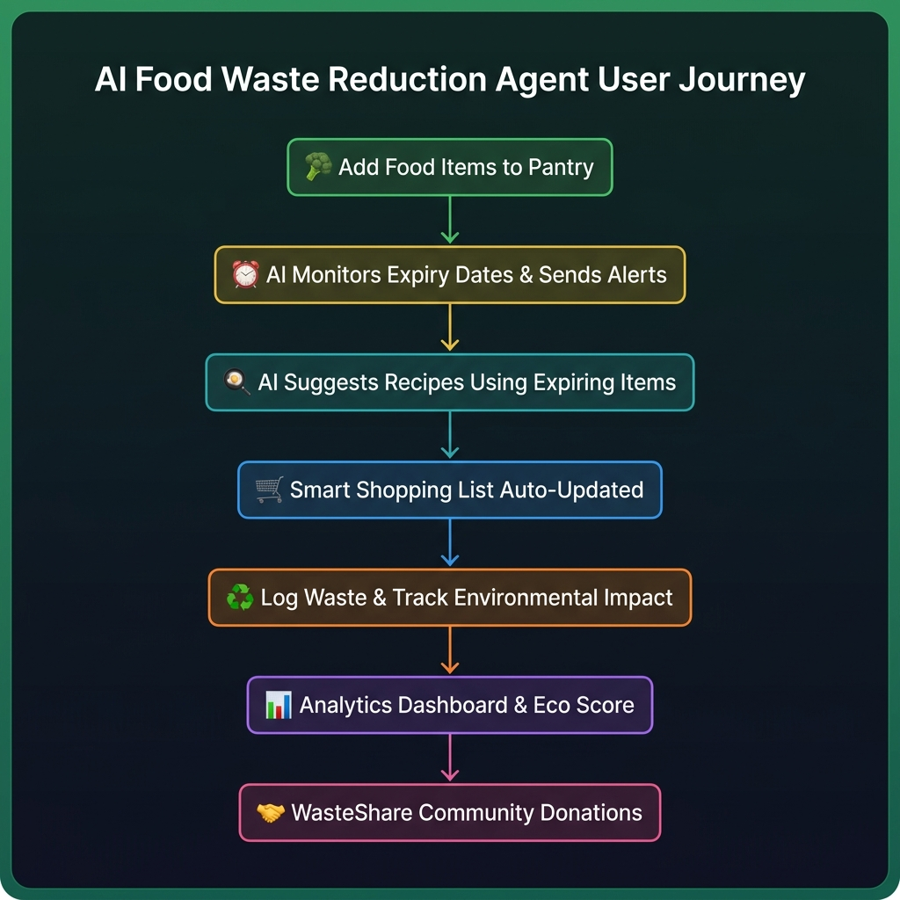
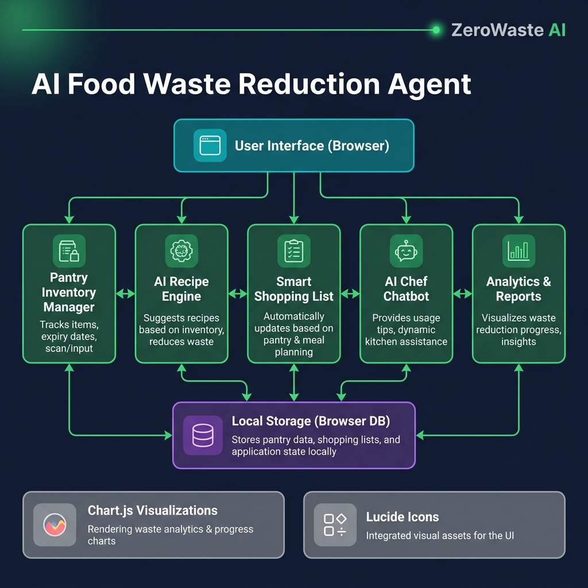

<div align="center">

# 🌿 AI Food Waste Reduction Agent

### *ZeroWaste AI — Smarter Kitchens. Greener Planet.*

[](https://opensource.org/licenses/MIT)
[](https://nodejs.org/)
[](https://developer.mozilla.org/en-US/docs/Web/HTML)
[](https://developer.mozilla.org/en-US/docs/Web/CSS)
[](https://developer.mozilla.org/en-US/docs/Web/JavaScript)
[](https://www.chartjs.org/)

> An intelligent, AI-powered web application that helps households **track food inventory**, **reduce waste**, **discover smart recipes**, and **measure their environmental impact** — all from the browser, with zero backend dependencies.

[🚀 Live Demo](#-getting-started) · [📖 Features](#-features) · [🏗️ Architecture](#️-system-architecture) · [🤝 Contributing](#-contributing)

</div>

---

## 📸 Application Preview

> ZeroWaste AI provides a full-featured, single-page experience with sidebar navigation across six intelligent modules.

| Dashboard | Pantry Inventory | AI Recipes |
|:---------:|:----------------:|:----------:|
| Real-time stats, alerts, expiry warnings | Track all food items + shelf life | AI-suggested recipes from expiring items |

| Smart Shopping | AI Chef Chat | Analytics |
|:--------------:|:------------:|:---------:|
| Auto-generated shopping lists | Conversational AI cooking assistant | Eco-score, waste logs & charts |

---

## 🎯 Project Overview

Every year, **1.3 billion tonnes** of food is wasted globally — accounting for **8–10% of all greenhouse gas emissions**. The ZeroWaste AI Agent is a capstone project built to tackle this challenge at the household level using smart AI-powered tools.

### The Problem
- Households forget what's in their fridge/pantry
- Food expires before it's used
- No easy way to plan meals around what's already available
- People have no visibility into their personal food waste footprint

### Our Solution
ZeroWaste AI provides a **complete household food intelligence system** that:
- 📋 Tracks all pantry items with expiry dates
- 🔔 Sends real-time alerts before items expire
- 🍳 Suggests AI-powered recipes using items about to expire
- 🛒 Auto-generates smart shopping lists
- ♻️ Logs and analyzes your personal food waste
- 🌍 Shows your environmental impact (CO₂, water saved)
- 🤝 Connects you to community food sharing (WasteShare)

---

## 🔄 System Workflow



### Step-by-Step User Journey

```
┌─────────────────────────────────────────────────────────────────┐
│                    ZeroWaste AI Workflow                         │
├─────────────────────────────────────────────────────────────────┤
│                                                                   │
│  1. 🥦  USER adds food items to Pantry with expiry dates         │
│              ↓                                                    │
│  2. ⏰  AI engine monitors shelf life & triggers alerts          │
│         (Red = expired, Amber = expiring in 3 days)             │
│              ↓                                                    │
│  3. 🍳  AI Recipe Engine suggests meals using expiring items     │
│         (Prioritizes items closest to expiry)                   │
│              ↓                                                    │
│  4. 🛒  Shopping List auto-updated when pantry items are used    │
│         (Smart deduplication + quantity tracking)               │
│              ↓                                                    │
│  5. ♻️  User logs consumed/wasted items                          │
│         (Waste tracking with reason codes)                      │
│              ↓                                                    │
│  6. 📊  Analytics Dashboard updates eco-scores & charts          │
│         (CO₂ saved, money saved, waste reduction %)             │
│              ↓                                                    │
│  7. 🤝  Excess food listed on WasteShare community board         │
│         (Connect with local food banks & neighbours)            │
└─────────────────────────────────────────────────────────────────┘
```

---

## 🏗️ System Architecture



### Technical Architecture

```
┌───────────────────────────────────────────────────────────────────┐
│                     Browser (Single Page App)                     │
│                                                                   │
│  ┌──────────┐  ┌──────────┐  ┌──────────┐  ┌──────────────────┐ │
│  │ index.html│  │styles.css│  │components│  │   Chart.js CDN   │ │
│  │  (UI SPA) │  │          │  │  .css    │  │  Lucide Icons    │ │
│  └──────────┘  └──────────┘  └──────────┘  └──────────────────┘ │
│                        ↓                                          │
│  ┌────────────────────────────────────────────────────────────┐  │
│  │                   app.js (SPA Coordinator)                 │  │
│  │                                                            │  │
│  │  ┌────────────┐  ┌───────────┐  ┌──────────────────────┐  │  │
│  │  │  pantry.js │  │recipes.js │  │    shopping.js        │  │  │
│  │  │  Inventory │  │AI Engine  │  │   Smart List          │  │  │
│  │  │  Manager   │  │           │  │                      │  │  │
│  │  └────────────┘  └───────────┘  └──────────────────────┘  │  │
│  │                                                            │  │
│  │  ┌────────────┐  ┌───────────┐  ┌──────────────────────┐  │  │
│  │  │ chatbot.js │  │analytics  │  │      share.js         │  │  │
│  │  │ AI Chef    │  │   .js     │  │   WasteShare          │  │  │
│  │  │ Assistant  │  │Dashboard  │  │   Community           │  │  │
│  │  └────────────┘  └───────────┘  └──────────────────────┘  │  │
│  └────────────────────────────────────────────────────────────┘  │
│                        ↓                                          │
│  ┌────────────────────────────────────────────────────────────┐  │
│  │          storage.js + mockData.js (Data Layer)             │  │
│  │              Browser LocalStorage API                      │  │
│  └────────────────────────────────────────────────────────────┘  │
└───────────────────────────────────────────────────────────────────┘
                        ↓
┌───────────────────────────────────────────────────────────────────┐
│               server.js (Static File Server)                      │
│              Node.js HTTP — Port 3000                             │
│        (Zero dependencies, serves static assets)                  │
└───────────────────────────────────────────────────────────────────┘
```

---

## ✨ Features

### 📋 Pantry Inventory Manager
- Add, edit, and delete food items with name, category, quantity, and expiry date
- Color-coded shelf-life indicators (🔴 Expired / 🟡 Expiring Soon / 🟢 Fresh)
- Filter and search pantry items by name or category
- Storage guide — tips on how to store each food type optimally
- Automatic badge counts in navigation for expiring items

### 🍳 AI Recipe Engine
- Intelligent recipe suggestions **prioritizing expiring ingredients**
- Recipes tagged by cuisine type, difficulty, and prep time
- One-click "Mark Ingredients as Used" to update pantry
- Recipe cards with full ingredient lists and instructions

### 🛒 Smart Shopping List
- Auto-generate shopping lists based on pantry gaps
- Manual item addition with quantity and store aisle
- Check off items while shopping
- Share shopping list via native share API
- Persistent across sessions via LocalStorage

### 🤖 AI Chef Chatbot
- Conversational AI cooking assistant (ZeroWaste Chef)
- Ask for recipe ideas, cooking tips, and substitutions
- Contextually aware of your current pantry contents
- Friendly, eco-conscious responses with food waste reduction tips

### 📊 Analytics & Eco Dashboard
- **Eco Score** — Your personal sustainability rating (0–100)
- Waste log with reason tracking (forgot, over-purchased, spoiled, etc.)
- Interactive charts: waste by category, weekly trends, savings over time
- CO₂ emissions saved calculations
- Money saved metrics
- Gamified challenges and badges for waste reduction milestones

### 🤝 WasteShare Community
- List excess food items for community sharing
- Browse items available from neighbours and food banks
- Request and donate food to reduce household waste
- Community impact leaderboard

### 🔔 Smart Notifications
- Browser notifications for items expiring in 1–3 days
- Daily eco-tip push notifications
- Milestone alerts when you hit waste reduction goals

---

## 📁 Project Structure

```
ai-food-waste-reduction-agent/
│
├── 📄 index.html              # Single Page Application — main UI shell
├── 🖥️  server.js              # Zero-dependency Node.js static file server
├── 📦 package.json            # Project metadata and npm scripts
│
├── 📂 css/
│   ├── styles.css             # Core design system, layout, themes, variables
│   └── components.css         # UI components — cards, modals, forms, buttons
│
├── 📂 js/
│   ├── app.js                 # 🎯 SPA coordinator — init, navigation, events
│   ├── pantry.js              # 🥦 Pantry inventory CRUD + expiry management
│   ├── recipes.js             # 🍳 AI recipe engine + ingredient matching
│   ├── shopping.js            # 🛒 Smart shopping list manager
│   ├── chatbot.js             # 🤖 AI Chef conversational assistant
│   ├── analytics.js           # 📊 Eco metrics, charts, waste logging
│   ├── share.js               # 🤝 WasteShare community board
│   ├── notifications.js       # 🔔 Browser push notification manager
│   ├── storage.js             # 💾 LocalStorage abstraction layer
│   └── mockData.js            # 🗄️  Seed data for demo & storage guides
│
└── 📂 docs/
    └── images/
        ├── architecture.png   # System architecture diagram
        └── workflow.png       # User journey workflow diagram
```

---

## 🚀 Getting Started

### Prerequisites

- [Node.js](https://nodejs.org/) v14+ (for the static file server)
- Any modern web browser (Chrome, Firefox, Edge, Safari)

### Installation & Setup

```bash
# 1. Clone the repository
git clone https://github.com/shreyanishad2404/AI-food-waste-reduction-agent.git

# 2. Navigate into the project
cd AI-food-waste-reduction-agent

# 3. Install dependencies (none required — zero dependencies!)
npm install

# 4. Start the local server
npm start
# OR
node server.js

# 5. Open your browser
# Navigate to: http://localhost:3000
```

### Quick Start (No Server Needed)
You can also open `index.html` directly in your browser — the app runs entirely client-side using browser LocalStorage.

---

## 🧰 Technology Stack

| Technology | Purpose | Version |
|:----------:|:-------:|:-------:|
| **HTML5** | Single Page Application UI structure | HTML5 |
| **CSS3** | Custom design system, animations, responsive layout | CSS3 |
| **Vanilla JavaScript** | App logic, ES6 modules, event system | ES2020+ |
| **Node.js** | Zero-dependency static file server | 14+ |
| **Chart.js** | Interactive analytics charts (CDN) | Latest |
| **Lucide Icons** | Crisp SVG icon set (CDN) | Latest |
| **Browser LocalStorage** | Client-side persistent data store | Web API |

> 💡 **Zero external dependencies** — no npm packages, no bundler, no build step required!

---

## 🌍 Environmental Impact Metrics

The AI agent calculates your real-world environmental savings:

| Metric | How It's Calculated |
|:------:|:-------------------:|
| 🌿 **CO₂ Saved (kg)** | Based on average food production emissions per category |
| 💧 **Water Saved (litres)** | Virtual water content of saved food items |
| 💰 **Money Saved (₹/£/$)** | Average market price of food categories × quantity saved |
| 🎯 **Eco Score (0–100)** | Composite score from waste rate, variety, and consistency |

---

## 🤝 Contributing

Contributions are welcome! Here's how you can help:

```bash
# 1. Fork the repository
# 2. Create your feature branch
git checkout -b feature/amazing-new-feature

# 3. Make your changes and commit
git commit -m "feat: add amazing new feature"

# 4. Push to your branch
git push origin feature/amazing-new-feature

# 5. Open a Pull Request
```

### Areas for Contribution
- 🔌 Real AI/ML integration (Gemini API, OpenAI API)
- 📱 Progressive Web App (PWA) support
- 🗄️ Backend database integration (Firebase, Supabase)
- 🌐 Multi-language support (i18n)
- 🧪 Unit and integration tests
- 🎨 New UI themes and accessibility improvements

---

## 📜 License

This project is licensed under the **MIT License** — see the [LICENSE](LICENSE) file for details.

---

## 👥 Team

| Role | Description |
|:----:|:-----------:|
| 🎓 **Capstone Project** | AI Food Waste Reduction Agent |
| 👨‍💻 **Team** | ZeroWaste AI Team |
| 🏫 **Context** | Computer Science / AI Capstone |

---

## 🙏 Acknowledgements

- [Chart.js](https://www.chartjs.org/) — Beautiful data visualizations
- [Lucide Icons](https://lucide.dev/) — Clean, consistent icon library
- [UN Food & Agriculture Organization](https://www.fao.org/) — Food waste statistics and research
- [WRAP UK](https://www.wrap.org.uk/) — Household food waste reduction data

---

<div align="center">

**🌱 Together, we can waste less and live more sustainably.**

⭐ Star this repo if you find it useful! ⭐

</div>
